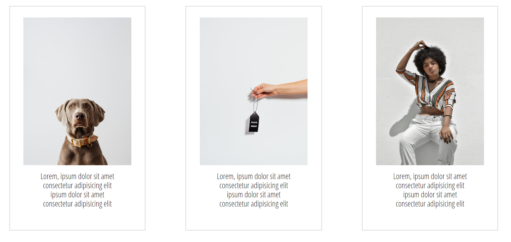

# # CodersCamp 2020 - Projekt HTML & CSS

## **Projekt wizytówka-portfolio**
-   [Opis projektu](https://github.com/neacatsu/CodersCamp2020.Project.HTML-CSS.BusinessCard#opis-projektu)
-   [About](https://github.com/neacatsu/CodersCamp2020.Project.HTML-CSS.BusinessCard#about)
-   [Description](https://github.com/neacatsu/CodersCamp2020.Project.HTML-CSS.BusinessCard#description)
-   [Gallery](https://github.com/neacatsu/CodersCamp2020.Project.HTML-CSS.BusinessCard#gallery)
-   [Contact](https://github.com/neacatsu/CodersCamp2020.Project.HTML-CSS.BusinessCard#contact)

## Opis projektu

-   Projekt w ramach :  Coders Camp 2020
-   Autor : Wiktoria Wierzbicka
-   Mentor : Radosław Bajor
-   Projekt jest stroną one-page'owa zawierająca nawigację, 4 podstrony oraz stopkę. Zawarte w stronie informacje są anonimowe. Nie są przypisane do mojej osoby.

## About

Podstrona About posiada dwa kontenery:

 1. lewy kontener- zdjęcie
 2. prawy kontener- krótki opis, wygenerowany tekst

## Description

Zawiera 3 równe kontenery, każdy z nich posiada inne zdjecie z przypisanym wygenerowanym tekstem. Border kontener jest zmieniany poprzez użycie `@keyframes`

## Gallery

Na tej podstronie znajduje się galeria która została wykonana na gridzie. Każdy z obrazów po najechaniu myszką powiększa się.

## Contact

W contacie znajdują się dwa kontenery:

 1. lewy kontener- zawiera formularz kontaktowy 
 2. prawy kontener- zawiera mapę z podanym adresem, krótki opis oraz linki do social medii.
 
 
